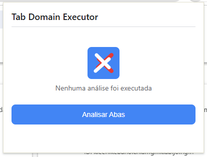
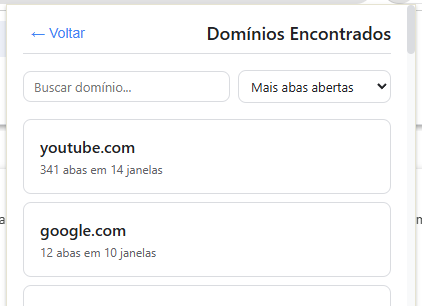
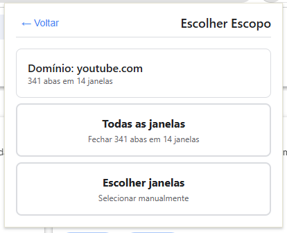
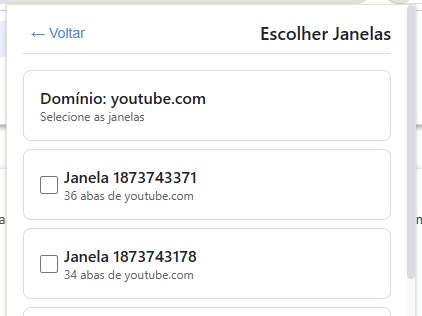
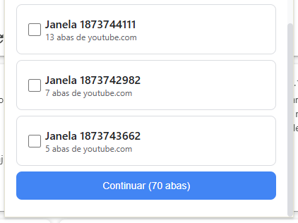

# Tab Domain Executor

<p align="center">
  
</p>

<p align="center">
  <a href="#instalação"></a>
  <a href="#licença"></a>
  
  
</p>

Extensão Chrome (Manifest V3) para **fechar abas agrupadas por domínio** de forma deliberada, segura e reversível — com recuperação de 15 minutos para ações em lote.

## O que faz

- Lê todas as abas abertas via `chrome.tabs.query({})`.
- Normaliza URLs com `normalizeUrl()` (remove fragmentos, trailing slashes, `www.`).
- Agrupa abas por domínio com `groupByDomain()`.
- Suporta escopo por **todas as janelas** ou **janelas selecionadas**.
- Fecha abas individualmente ou em grupo.
- **Recuperação pós-fechamento**: restaura o último lote em até 15 minutos via `RecoveryManager`.

## Instalação

1. Abra `chrome://extensions`
2. Ative **Modo do desenvolvedor**
3. Clique em **Carregar sem compactação**
4. Selecione a pasta `dist/` após executar `npm run build`

Documentação completa: [docs/TDE-Documentation-v1.html](docs/TDE-Documentation-v1.html)

## Screenshots

<p align="center">
  
  
</p>

<p align="center">
  
  
</p>

<p align="center">
  
  
</p>

Documentação consolidada (HTML): [docs/TDE-Documentation-v1.html](docs/TDE-Documentation-v1.html)

## Estrutura (resumo)

- `background/`: Service Worker (orquestração de mensagens e estado)
- `modules/`: 5 módulos independentes — `tab-reader`, `normalizer`, `grouper`, `executor`, `recovery`
- `popup/`: UI do popup (estado, componentes, estilos)
- `shared/`: tipos TypeScript, constantes e utilitários
- `tests/`: testes unitários e integração (62 testes, 6 suites)
- `config/`: configuração de ESLint e Jest
- `docs/`: documentação completa
- `assets/`: screenshots e ícones

Para detalhes de arquitetura e fluxos: veja [docs/ARCHITECTURE.md](docs/ARCHITECTURE.md).

## 🧪 Testabilidade

Os módulos em `modules/` são agnósticos de Chrome APIs e podem ser testados isoladamente:

```typescript
import { normalizeUrl } from './modules/normalizer';

// Normaliza (remove www., trailing slash, fragmentos)
const url = 'https://www.youtube.com/watch?v=abc#section';
const normalized = normalizeUrl(url);

console.log(normalized);
// https://youtube.com/watch?v=abc
```

```bash
npm test                  # Executar todos os testes (62)
npm run test:coverage     # Com relatório de cobertura
```

## 📝 Convenções de Código

- **TypeScript strict**: `strict: true` em 100% do código
- **Módulos**: `import`/`export` ES6
- **Async/Await**: para todas as operações assíncronas
- **Naming**:
  - Arquivos: kebab-case (`tab-reader.ts`)
  - Funções: camelCase (`normalizeUrl()`)
  - Constantes: UPPER_SNAKE_CASE (`RECOVERY_TTL_MS`)
  - Tipos: PascalCase (`DomainGroup`)

## 🛡️ Segurança

- ❌ Sem rede/terceiros: todo processamento é local.
- ✅ Permissão mínima: apenas `"tabs"` no manifest.
- ✅ Ações explícitas do usuário via fluxo multi-etapas.
- ✅ Validação e tratamento de erros em `shared/utils/validators.ts`.
- ✅ Estado temporário em memória no Service Worker (sem `localStorage` ou `chrome.storage`).

## 👨‍💻 Desenvolvimento

### Build e watch

```bash
npm run dev     # Build + watch (Webpack)
npm run build   # Build de produção
npm run clean   # Limpar dist/ e coverage/
```

Após mudanças, recarregue a extensão em `chrome://extensions` (ícone 🔄).

### Adicionar novo módulo

1. Criar pasta em `modules/novo-modulo/`
2. Exportar via `index.ts`
3. Registrar o tipo de mensagem em `shared/types/message.types.ts`
4. Implementar handler em `background/message-dispatcher.ts`

### Debug

- **Popup**: clique com botão direito no popup → **Inspecionar**
- **Service Worker**: `chrome://extensions` → **Detalhes** → **Inspecionar visualizações**

### Linting e formatação

```bash
npm run lint        # Verificar
npm run lint:fix    # Corrigir
npm run format      # Formatar com Prettier
```

## Licença

Licenciado sob a licença MIT. Veja o arquivo [LICENSE](LICENSE).

Desenvolvedor: Pedro Labre

## Contribuição

Sugestões, issues e PRs são bem-vindos. Para mudanças maiores, prefira abrir uma issue descrevendo o contexto e o objetivo.

**Desenvolvido com foco em arquitetura limpa, separação de responsabilidades e reversibilidade de ações destrutivas.**
